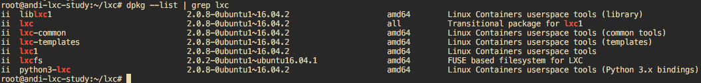
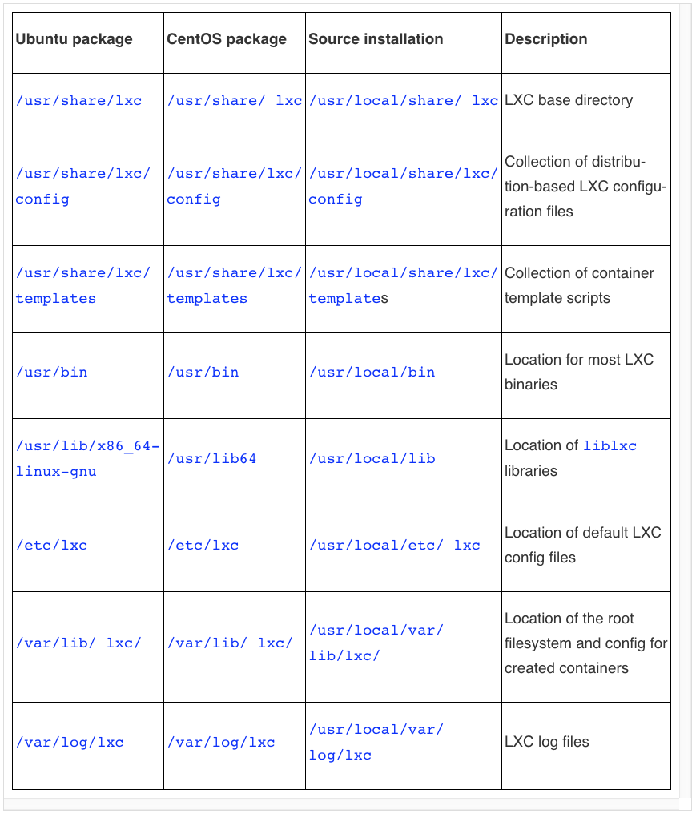

# 리눅스에서 LXC 설치 및 실행

## 설치

### Ubuntu/apt
Ubuntu 16.04.1 LTS Xenial 환경에서

``` bash
apt-get -y install -y lxc bridge-utils \
  debootstrap libcap-dev cgroup-bin \
  libpam-systemd bridge-utils
```



[LXC 2.0 Release Announcement](https://stgraber.org/2016/04/06/lxc-2-0-has-been-released/)


### 소스로부터 설치
GitHub 리포가 있음 [LXC 깃헙 repo](https://github.com/lxc/lxc) 3.0 버전대

``` bash
git clone https://github.com/lxc/lxc.git
cd lxc
```

빌드하기 위한 패키지 설치

``` bash
apt-get install -y build-essential libtool \
  automake pkg-config bridge-utils \
  libcap-dev libcgmanager-dev cgmanager
```

설치
``` bash
./autogen.sh
./configure \
  --enable-capabilities \
  --enable-cgmanager
make && make install
```

확인
``` bash
lxc-create --version
# 3.0.0
```

제거
``` bash
make uninstall
```

설치 과정일 뿐이므로 CentOS/yum은 하지 않았음.


### LXC 디렉토리 레이아웃
소스 또는 패키지로 설치 후 디렉터리 레이아웃. 설치 방법과 distro에 따라 다를 수 있으니 참고만


출처: Containerization with LXC

## LXC 컨테이너 만들고 조작하기

1장에서는 매뉴얼하게 namespace를 만들고 cgroup으로 리소스 제한을 해봤다면 이제 userspcae tools을 이용해서 더 편리하게 같은 작업을 할 것임
* LXC 툴셋은 `liblxc` API에서 정의하는 함수들의 구현을 제공함
* LXC는 리눅스 디스트로들의 root filesystem을 만들기 위한 템플릿들을 제공함
* `debootstrap`이나 `yum`을 이용해서 나만의 root filesystem을 만들 수도 있음

### `lxc-download` 템플릿을 이용해서 container 만들기
```bash
lxc-create -t download -n c1
```

### 컨테이너 리스트 출력
```bash
lxc-ls -f
```

### 컨테이너 시작
```bash
lxc-start -n c1 -d -l DEBUG # lxc.init.cmd가 실행됨
```

### 컨테이더 정보
```bash
lxc-info -n c1
```


