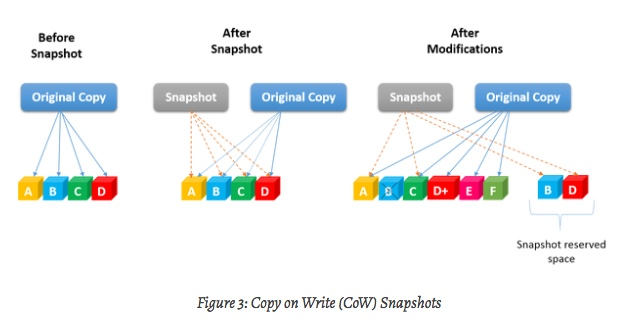
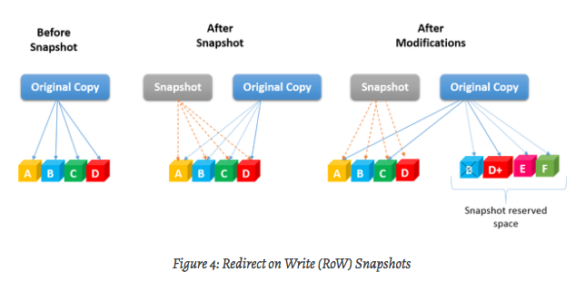

# 03 네이티브 도구와 libvirt 도구를 이용한 명령행 작업

## 2장에서
* /var/lib/lxc/{container-name}/rootfs 를 컨테이너의 루트 파일 시스템으로 사용함
```
/var/lib/lxc/{container-name}/rootfs 디렉토리의 하위 디렉토리를 백업 저장소라고 하며, 'dir', 'lvm', 'loop', 'brtfs', 'zfs', 'rbd', 'best' 를 지정할 수 있다.
기본값은 'dir' 로 컨테이너 루트 파일시스템을 의미한다.
```
* LVM, Brtfs, ZFS 같은 저장소를 사용해 컨테이너 스냅샷과 백업같은 고급기능을 사용할 수 있다.
* 3장에서는 LXC 도구에 대한 대안으로 libvirt 가 제공하는 컨테이너 생성 및 관리를 위한 도구를 살펴볼 것이다.

## 3장에서 배울 내용
* 백업 저장소로 LVM을 사용하는 컨테이너 만들기
* Btrfs 위에서의 LXC
* ZFS를 백업 저장소로 사용하기
* 컨테이너 자동 시작하기
* 컨테이너 훅 추가하기
* 인스턴스의 실행 파일시스템 탐색과 호스트에서의 파일 접근
* 실행중인 컨테이너 고정하기
* 컨테이너의 자원 사용량 제한하기
* libvirt 라이브러리와 도구를 이용해 컨테이너 만들기

## LVM 백업 저장소 사용하기
* LVM = Logical Volume Manager
* [redhat LVM 아키텍처 개요](https://access.redhat.com/documentation/ko-kr/red_hat_enterprise_linux/6/html/logical_volume_manager_administration/lvm_definition)
* 왠지 모르겠지만 우분투 위키가 접근이 안됨..
* 물리적 블록 장치들을 모아 논리적 볼륨으로 전환할 수 있는것
* LVM 을 사용하면 파일시스템의 크기를 증가시키고 싶을때 Physical Volume Pool 에 물리 블록 장치들을 추가만 해주면 된다.
* PV 로부터 Volume Group 을 만들 수 있고, VG는 PV간에 분할, 병합 이동할 수 있다.
* VG는 하나 이상의 LV 로 나워 사용할 수 있다.
* LV 는 여러 디스크에 걸쳐 파일시스템을 생성할 수 있다.
* 새로운 LV 가 원본 LV 의 복사본으로 작동하도록 스냅샷 생성 기능을 허용하기 때문에 LXC 에서 이 기능을 활용해서 컨테이너의 복사본을 빠르게 생성할 수 있다.

* 실습
```sh
# LVM 패키지 설치 (이미 설치됨)
apt install lvm2
# df 로 파일시스템 확인
df -hT
# fdisk 로 파일시스템 확인
fdisk -l /dev/vdb
# fdisk 로 LVM 형식의 파티션 생성 (/dev/vda1 이 루트파일시스템)
fdisk /dev/vdb
# n -> p -> 1 -> 엔터 -> 엔터 -> t -> 8e -> p -> w  순서로 커맨드 입력
```

```
fdisk /dev/vdb

Welcome to fdisk (util-linux 2.27.1).
Changes will remain in memory only, until you decide to write them.
Be careful before using the write command.


Command (m for help): t
Partition number (1,2, default 2): 1
Partition type (type L to list all types): 8e

Changed type of partition 'Linux' to 'Linux LVM'.

Command (m for help): w
```

=====

## 디바이스 새로 연결
```sh
# 볼륨 확인
ll /dev/disk/by-uuid
sudo mount /dev/vdb /data
```

```sh
fdisk -l /dev/vdb
fdisk /dev/vdb
pvcreate /dev/vdb1
vgcreate lxc /dev/vdb1

# lxc 설정
apt update
apt install -y lxc bridge-utils debootstrap libcap-dev

# 프록시 설정
export http_proxy=http://proxy.daumkakao.io:3128
export HTTP_PROXY=$http_proxy
export https_proxy=$http_proxy
export HTTPS_PROXY=$http_proxy

# https://linuxcontainers.org/ko/lxc/manpages/man1/lxc-create.1.html
lxc-create --bdev lvm --fssize 10G --name lvm_container --template ubuntu

lxc-ls -f
NAME          STATE   AUTOSTART GROUPS IPV4 IPV6
lvm_container STOPPED 0         -      -    -

# Physical Volume
pvs
  PV         VG   Fmt  Attr PSize  PFree
  /dev/vdb1  lxc  lvm2 a--  50.00g 40.00g

# Volume Group (앞서 lxc 라는 이름으로 미리 생성함)
vgs
  VG   #PV #LV #SN Attr   VSize  VFree
  lxc    1   1   0 wz--n- 50.00g 40.00g

# Logical Volume
lvs
  LV            VG   Attr       LSize  Pool Origin Data%  Meta%  Move Log Cpy%Sync Convert
  lvm_container lxc  -wi-a----- 10.00g

lxc-start -n lvm_container
lxc-ls -f
  NAME          STATE   AUTOSTART GROUPS IPV4 IPV6
  lvm_container RUNNING 0         -      -    -

# 생성한 lvm_container 의 backend 공간 설정값 확인
cat /var/lib/lxc/lvm_container/config | grep lxc.*.backend
  lxc.rootfs.backend = lvm

# 디바이스 매퍼가 신규로 생성한 블록장치 확인
ls -al /dev/lxc/ | grep lvm
lrwxrwxrwx  1 root root    7 Nov  6 21:36 lvm_container -> ../dm-0
ls -al /dev/mapper/ | grep lvm
lrwxrwxrwx  1 root root       7 Nov  6 21:36 lxc-lvm_container -> ../dm-0

# lvdisplay 명령으로 LV 정보 확인
lvdisplay
  --- Logical volume ---
  LV Path                /dev/lxc/lvm_container
  LV Name                lvm_container
  VG Name                lxc
  LV UUID                SQBxh3-VRtb-EKf3-VLWh-SYwD-d6EY-j2lXU9
  LV Write Access        read/write
  LV Creation host, time container-test03.pg1.krane.9rum.cc, 2018-11-06 21:35:50 +0900
  LV Status              available
  # open                 1
  LV Size                10.00 GiB
  Current LE             2560
  Segments               1
  Allocation             inherit
  Read ahead sectors     auto
  - currently set to     256
  Block device           252:0

```

## LVM 백업 저장소에 컨테이너 스냅샷 만들기

## COW, ROW

COW (Copy on Write)
- 1~20% 정도의 스냅샷 공간을 미리 할당
- 스냅샷 생성
- 데이터를 복사하지 않고, 포인터로 데이터를 가리키게함
- 원본 데이터가 바뀌면 원본을 읽어(읽기)
- 스냅샷 공간으로 복사(쓰기)
- 원본 데이터에 변경 데이터로 덮어씌움(쓰기)
- 원본 데이터가 바뀔때마다 스냅샷 공간에 복사하므로 오버해드가 크다.(읽기 1번, 쓰기 2번)


ROW(Redirect on write)
- 스냅샷을 위한 공간을 미리 할당하지 않아도 된다.
- COW처럼 데이터를 포인터로 가리킨다.
- 원본이 변경되려하면, 그 데이터를 스냅샷에 묶어버린다.
- 변경 데이터는 새로운 공간에 할당되고, 포인터가 새로 가리키게된다.


* 사진은 없지만 잘 정리된 곳..
* http://blog.naver.com/PostView.nhn?blogId=cheory79&logNo=220694992055

## 스냅샷 생성

```sh
# 스냅샷 생성
lxc-copy --snapshot --name lvm_container_2 --newname container_2_copy
Logical volume "container_2_copy" created

# 컨테이너 리스트
lxc-ls -f
NAME             STATE   AUTOSTART GROUPS IPV4 IPV6
container_2_copy STOPPED 0         -      -    -
container_2_hard STOPPED 0         -      -    -
lvm_container_2  STOPPED 0         -      -    -

# Logical Volume 리스트
lvs
LV               VG   Attr       LSize Pool Origin          Data%  Meta%  Move Log Cpy%Sync Convert
container_2_copy lxc  swi-a-s--- 5.00g      lvm_container_2 0.09
lvm_container_2  lxc  owi-a-s--- 5.00g

* Attr 열을 보면 스냅샷임을 나태는 s속성이 붙어있음을 알 수 있다.

# 원본 컨테이너 복사
lxc-copy --name lvm_container_2 --newname container_2_hard
Logical volume "container_2_hard" created
* --snapshot 속성을 지정 안 하면, 원본 컨테이너 파일시스템 전체 복사

# Logical Volume 리스트
lvs
LV               VG   Attr       LSize Pool Origin          Data%  Meta%  Move Log Cpy%Sync Convert
container_2_copy lxc  swi-a-s--- 5.00g      lvm_container_2 0.09
container_2_hard lxc  -wi-a----- 5.00g
lvm_container_2  lxc  owi-a-s--- 5.00g
```

# Btrfs 백업 저장소 사용하기
- Btrfs : B-tree filesystem
- 동적인 inode 할당, 압축, 온라인 중 파일시스템 단편화 정리 등의 현대적 기능을 제공하는 COW 파일 시스템
- 쓰기가능/읽기전용 의 스냅샷 기능 제공
- Extent 트리와 서브볼륨 트리의 루트 블록을 기록하는 Btrfs 루트 트리로 구성
- Extent 트리 : 디스크 공간을 관리하고 장치 내의 블록들에 대한 정보를 갖고 있음.
- 서브볼륨 트리 : 서브볼륨 같은 스냅샷을 기록. Btrfs 서브볼륨은 실제 블록 장치가 아님.

```sh
# Btrfs 지원 도구 설치
apt-get -y install btrfs-tools

# 커널 모듈 로드
modprobe btrfs
lsmod | grep btrfs

# 파일시스템 생성
mkfs -t btrfs /dev/vdc

# 블록장치(/dev/vdc)의 파일시스템 형식 확인 : BTRFS
file -s /dev/vdc
/dev/vdc: BTRFS Filesystem sectorsize 4096, nodesize 16384, leafsize 16384, UUID=4ee02ae4-686f-4de4-9ce9-5ea45a9b1b16, 114688/32212254720 bytes used, 1 devices

# 추가 정보
btrfs filesystem show
Label: none  uuid: 4ee02ae4-686f-4de4-9ce9-5ea45a9b1b16
Total devices 1 FS bytes used 112.00KiB
devid    1 size 30.00GiB used 2.02GiB path /dev/vdc

# 블록 디바이스 마운트
mkdir btrfs_c1
mount /dev/vdc btrfs_c1
cat /proc/mounts | grep btrfs
/dev/vdc /root/btrfs_c1 btrfs rw,relatime,space_cache,subvolid=5,subvol=/ 0 0

# 서브볼륨과 디스크 공간 사용량 확인
btrfs subvolume show /root/btrfs_c1
/root/btrfs_c1 is toplevel subvolume

btrfs filesystem df /root/btrfs_c1
Data, single: total=8.00MiB, used=256.00KiB
System, DUP: total=8.00MiB, used=16.00KiB
Metadata, DUP: total=1.00GiB, used=112.00KiB
GlobalReserve, single: total=16.00MiB, used=0.00B
```

## Btrfs 백업 저장소를 사용해 LXC 컨테이너 만들기

```sh
# 컨테이너 생성
lxc-create --bdev btrfs --lxcpath=btrfs_c1 --name btrfs_container --template ubuntu
Checking cache download in /var/cache/lxc/xenial/rootfs-amd64 ...
Copy /var/cache/lxc/xenial/rootfs-amd64 to btrfs_c1/btrfs_container/rootfs ...
Copying rootfs to btrfs_c1/btrfs_container/rootfs ...
...

# 생성 확인
lxc-ls --lxcpath=/root/btrfs_c1 -f

# /var/lib/lxc 가 아닌 다른 위치를 root filesystem으로 사용
lxc-config lxc.lxcpath
/var/lib/lxc
echo "lxc.lxcpath = /root/btrfs_c1" >> /etc/lxc/lxc.conf
lxc-config lxc.lxcpath
/root/btrfs_c1

# 모든 Btrfs 컨테이너 목록 조회
lxc-ls -f

# 컨테이너 루트 파일시스템과 설정 파일이 Btrfs 볼륨에 있는지 확인
ls -la btrfs_c1/btrfs_container/

# 컨테이너의 루트가 Btrfs 파일시스템에 있는지 확인하기 위한 모든 서브볼륨 목록 조회
btrfs subvolume list /root/btrfs_c1/
ID 257 gen 18 top level 5 path btrfs_container/rootfs
```

## Btrfs 백업 저장소를 사용해 LXC 컨테이너 만들기
```sh
# 백엔드 백업 저장소 지정 및 새로운 컨테이너 생성(스냅샷)
lxc-copy --lxcpath=/root/btrfs_c1 -s -n btrfs_container -N btrfs_cow_clone
lxc-ls --lxcpath=/root/btrfs_c1 -f
NAME            STATE   AUTOSTART GROUPS IPV4 IPV6
btrfs_container STOPPED 0         -      -    -
btrfs_cow_clone STOPPED 0         -      -    -

# Btrfs 파일시스템 변화
btrfs subvolume list /root/btrfs_c1/
ID 257 gen 31 top level 5 path btrfs_container/rootfs
ID 259 gen 21 top level 5 path btrfs_cow_clone/rootfs

ls -la btrfs_c1/
total 28
drwxr-xr-x 1 root root  124 Nov 12 21:04 .
drwx------ 5 root root 4096 Nov 12 20:57 ..
drwxrwx--- 1 root root   62 Nov 12 20:53 btrfs_container
drwxrwx--- 1 root root   62 Nov 12 20:53 btrfs_cow_clone

# lxc.rootfs 설정 옵션 확인
cat btrfs_c1/btrfs_container/config | grep -vi ^# | grep lxc
lxc.include = /usr/share/lxc/config/ubuntu.common.conf
lxc.rootfs = btrfs_c1/btrfs_container/rootfs
lxc.rootfs.backend = btrfs
lxc.utsname = btrfs_container
lxc.arch = amd64
lxc.network.type = veth
lxc.network.link = lxcbr0
lxc.network.flags = up
lxc.network.hwaddr = 00:16:3e:a5:6f:22

# 컨테이너 시작
lxc-start --lxcpath=/root/btrfs_c1 -n btrfs_cow_clone
lxc-start --lxcpath=/root/btrfs_c1 -n btrfs_container

# 동작 확인
lxc-ls -f
NAME             STATE   AUTOSTART GROUPS IPV4       IPV6
btrfs_container  RUNNING 0         -      10.0.3.178 -
btrfs_cow_clone  RUNNING 0         -      -          -

# 컨테이너 중지
lxc-stop --lxcpath=/root/btrfs_c1 -n btrfs_container
lxc-stop --lxcpath=/root/btrfs_c1 -n btrfs_cow_clone

# 기존 설정 복구
umount /root/btrfs_c1
echo "lxc.lxcpath = /var/lib/lxc" > /etc/lxc/lxc.conf
lxc-config lxc.lxcpath
/var/lib/lxc
```

# ZFS 백업 저장소 사용하기
- 파일시스템이면서 LVM
- 여러 블록 장치들을 관리하는 저장소 풀로 구성
- 작동 중에 쉽게 확장이 가능하도록 파일시스템에 가상의 저장소 인터페이스를 제공
- LVM과 비슷하게 다중 블록 디바이스를 저장소 풀에 모으고, 이를 사용해 각기 다른 디렉토리를 만들 수 있음.
- 주요 기능 : 투명한 체크섬 구현, 데이터ㅢ 압축과 중복 제거, 일정 시간 디렉토리를 병렬로 조작 및 LXC에서 가장 중요하게 여겨지는 COW 스냅샷과 복제 등을 통해 데이터 안정성을 제공
